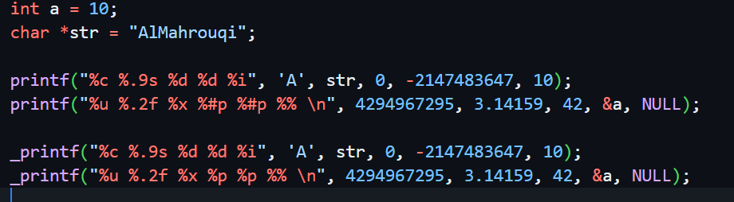
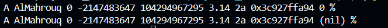

# _printf
## Overview
`_printf` is a custom implementation of the standard `printf` function in C based on the low-level Unix System Call `write`.  
The `_printf` function uses `_putchar` function which based on `write` System Call to write a single character to the standard output.  
This project enabled me to showcase of variadic functions, utilize low-level output functions, implement converting functions between int, long long, hexadecimal, and string, also dive into the implementation of the built-in functions.
## Sample
### Sample Input

### Sample Output

## Features
1. Modular Design:
- Separate files for the header file, core implementation, and helping functions.
2. Supported Format Specifiers:
- `c`: Print a single character.
- `s`: Print a string of characters.
- `d` or `i`: Print a signed int.
- `u`: Print an unsigned int.
- `f`: Print a floating-point number.
- `x`: Print a hexadecimal number (lower case).
- `p`: Print a memory address.
- `%%`: Print a literal `%` character.
3. Converting Types Functions:
- `intToString`: Converts int (32-bit) to string.
- `uIntToString`: Converts unsigned int to string.
- `stringToInt`: Converts string to int (32-bit).
- `isDigit`: Check if a character is a digit or not.
- `llToString`: Converts long long (int 64-bit) to string.
- `llToHex`: Converts long long (int 64-bit) to hexadecimal (lower case).
- `uPtrToHex`: Converts uintptr_t number to hexadecimal (lower case).
4. Cases Handling:
- Handeled case of NULL string by printing (null)
- Handeled case of NULL pointer by printing (nil)
5. Custom Features:
- `.9s`: Print at max 9 characters of a string.
- `.2f`: Print 2 decimal numbers after the float point.
## Project Structure
```
|
|-- src/
|   |-- main.c              // Contain a sample test case.
|   |-- _printf.c           // The core implementation of the _printf function.
|   |-- _putchar.c          // implementation of _putchar function using write function.
|   |-- convertingTypes.c   // Contains some converting function such as intToString.
|   |-- main.h              // The header file which contains the functions prototypes.
|-- images/                 // Images used in the project.
```
## How to Compile and Run
1. Clone the repository:
```
https://github.com/Almahrouky/_printf.git
cd src/
```
2. Compile the project:
```
gcc main.c _printf.c _putchar.c convertingTypes.c -o main
```
3. Run the executable:
```
./main
```